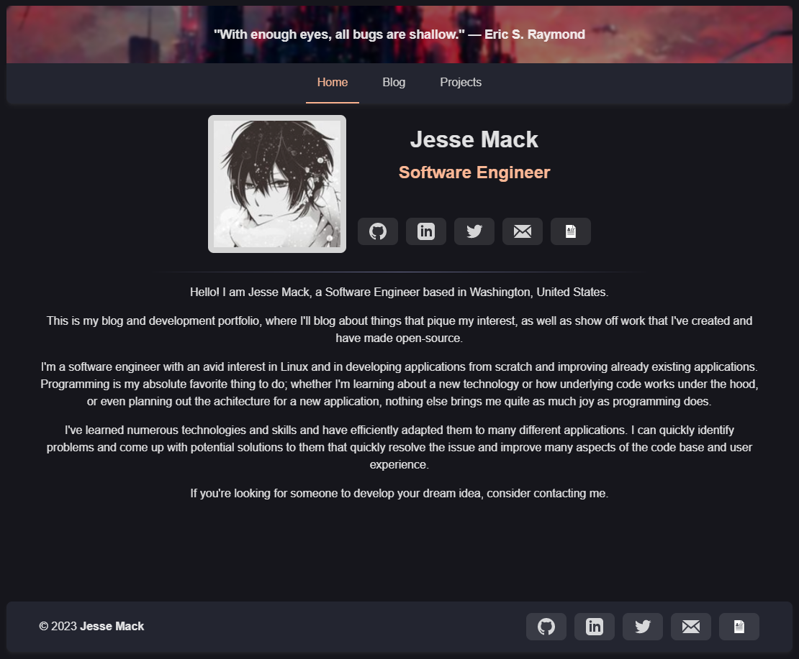
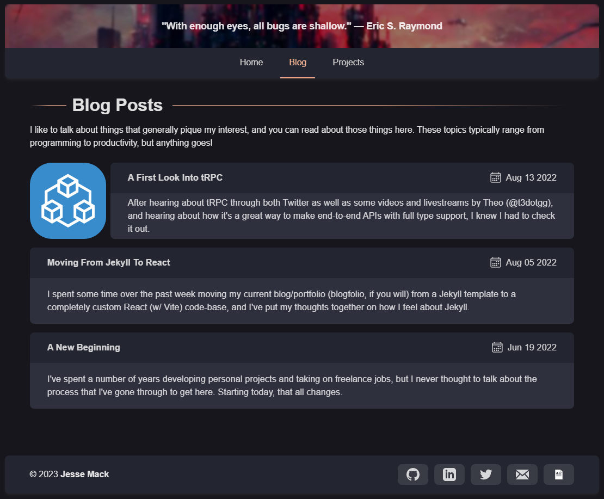
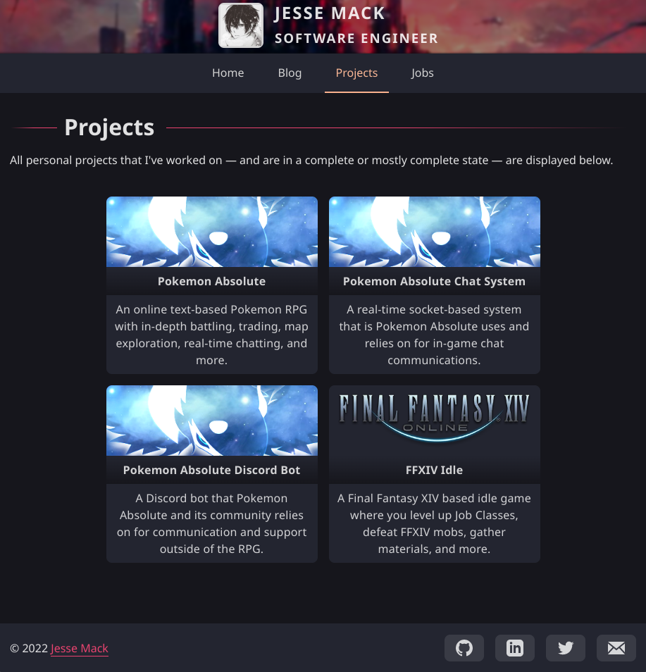
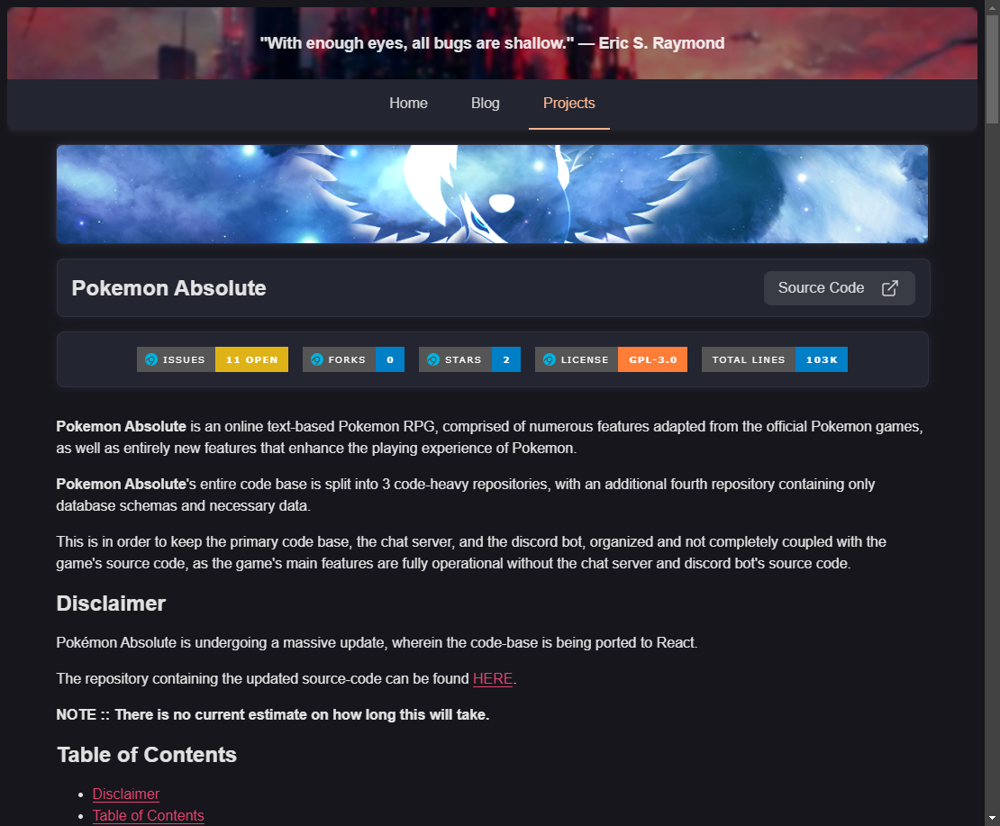
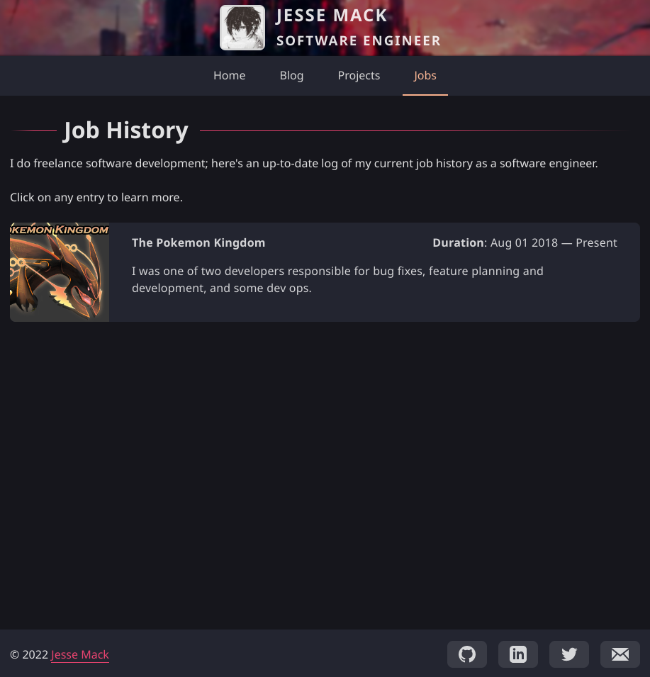
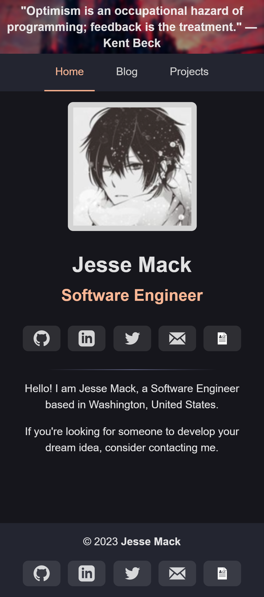
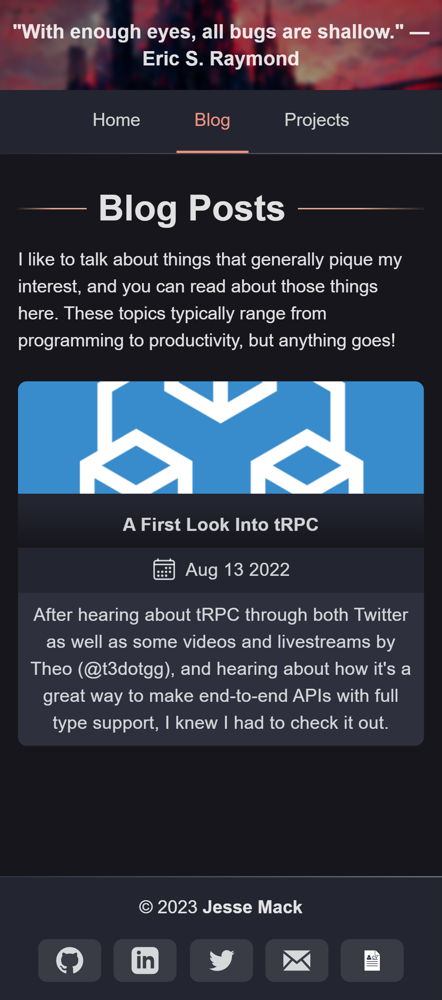
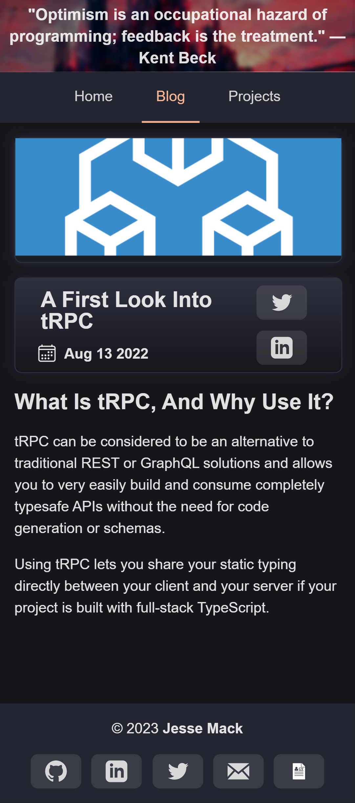
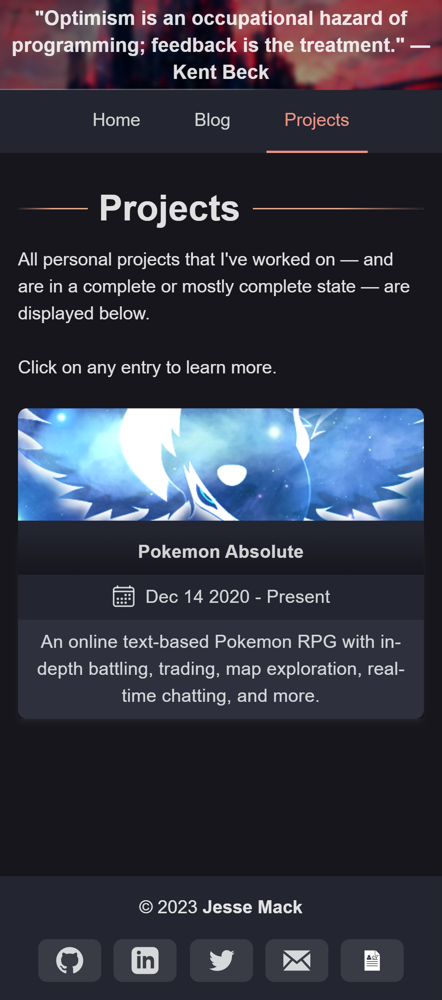
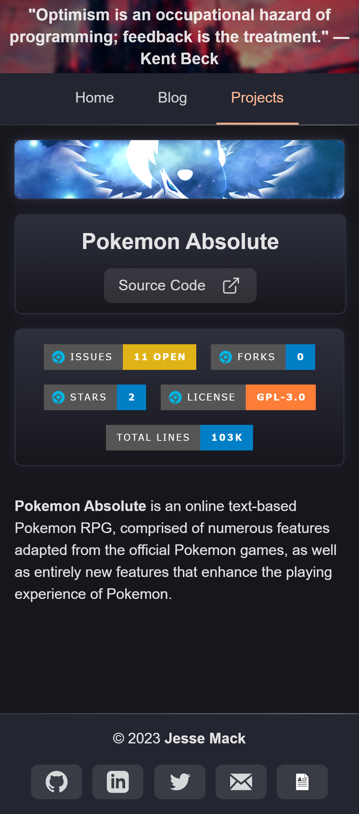

<div align="center">
  <h1 align="center">Jess' Blog &amp; Portfolio</h1>

  I created this blog / portfolio repository in order to showcase my own projects, blog about things that really pique my interest or to document things that I've experienced as a software engineer, and to showcase freelance jobs that I've done.

  Other blog / portfolio templates didn't cut it for me, and I wanted to create something that was easy to use, easy to add to, and painless to deploy to the web.

  If you're interested in using this repository as a template, please consider forking it and leaving a star.

  
  
  
  
  <a href="https://visitorbadge.io/status?path=https%3A%2F%2Fgithub.com%2FToxocious%toxocious.github.io">
    
  </a>
  <br /><br />

  Check us out on Discord if you have any questions or immediate feedback!

  <a href="https://discord.gg/Km6btPhs" target="_blank">
    
  </a>
</div>
<br />


# Table of Contents
- [Table of Contents](#table-of-contents)
- [About The Project](#about-the-project)
  - [Screenshots](#screenshots)
  - [Tech Stack](#tech-stack)
  - [Features](#features)
- [Getting Started](#getting-started)
  - [Prequisites](#prequisites)
  - [Installation](#installation)
  - [Building And Previewing](#building-and-previewing)
- [Deploying To Github](#deploying-to-github)
- [Updating Your Personal Information](#updating-your-personal-information)
- [Updating & Managing SEO](#updating--managing-seo)
- [Adding Blog Posts](#adding-blog-posts)
- [Adding Project Posts](#adding-project-posts)
- [Showcase Your Resume](#showcase-your-resume)
- [License](#license)


# About The Project
## Screenshots
<div align="center">
  <details>
    <summary>Desktop Previews</summary>
    
    
    
    
    
    <!-- 
     -->
  </details>

  <br />

  <details>
    <summary>Mobile Previews</summary>
    <h3>Some page content is cut in order to keep preview images friendly.</h3>
    
    
    
    
    
    <!-- 
     -->
  </details>
</div>


## Tech Stack
- TypeScript
- Astro
- SASS

## Features
- Responsive layout and styling for mobile devices
- Create and display blog posts
- Create and display projects
- Create and display work history


# Getting Started
## Prequisites
This project uses the **pnpm** package manager.

If you have NPM installed:
```sh
npm i -g pnpm
```

If you don't have NPM installed and are on Windows:
```sh
# Windows Powershell
iwr https://get.pnpm.io/install.ps1 -useb | iex
```

If you don't have NPM installed and are on a POSIX-based system w/ CURL:
```sh
# POSIX Systems w/ CURL
curl -fsSL https://get.pnpm.io/install.sh | sh -
```

If you don't have NPM installed and are on a POSIX-based system w/o CURL:
```sh
# POSIX System w/o CURL
wget -qO- https://get.pnpm.io/install.sh | sh -
```

## Installation
Clone the repository, install the necessary packages, and run the dev environment.

```sh
## Clone via HTTPS
# git clone https://github.com/Toxocious/toxocious.github.io.git

## Clone via SSH
# git clone git@github.com:Toxocious/toxocious.github.io.git

## CD into the repository directory
cd toxocious.github.io

## Install all needed modules.
pnpm install

## Run Vite
pnpm dev
```

## Building And Previewing
Build the project so that you can run it statically locally or remotely.

```sh
pnpm build
```

Preview the build on a local network IP to preview the static generated site.

```sh
pnpm preview
```


# Deploying To Github
The app can now be deployed to the provider of your choice, but we'll cover deployment to Github here.

1. Open the `astro.config.mjs` file in the root directory of the repository
2. Change the `site: 'https://toxocious.is-a.dev/'` value to the domain that you will be deploying to.
3. Commit and push to the `main` branch of your repoository

Once you've followed these steps and the deployment has completed, you can navigate to the URL associated with the Github Pages deployment in order to view your blog/portfolio.

> NOTE: If you are deploying to a custom domain (not *.github.io), open `./public/CNAME` and put your custom domain there.


# Updating Your Personal Information
For ease of use and to allow for quick updating of your personal information, a configuration file is included (`./src/config/index.ts`).

Various aspects of the site will grab your information from the values set in this file, such as your name, job title, and social links.

Currently, this file supports six key value pairs, which should be updated to use your specific information.

For any social links (git, linked_in, email, etc.), if you would like to omit the applicable buttons and links from your site, simply provide an empty string ('', quotes with nothing inside) and they will not be rendered to the page.

**Example Configuration**
```ts
export const config = {
  name: 'FIRST LAST',
  occupation: 'JOB TITLE',
  location: 'SOMEWHERE, OVER THE RAINBOW',

  email: 'example@example.com',
  github: 'USERNAME',
  gitlab: 'USERNAME',
  linked_in: 'PROFILE_ID',
  twitter: 'USERNAME',

  // File name of your resume.
  // This needs to be placed inside of the
  //    /public/resume
  // directory
  resume: 'software_engineer_resume.pdf'

  // the paragraphs shown on the index/home page of the site
  // you can have any number of paragraphs
  // wrap each paragraph in quotes and end each one with a comma
  summary: [
    'hey, i am paragraph one!',

    'let me tell you about something in this second paragraph',

    'and look at me; we are in paragraph three now'
  ],
};
```


# Updating & Managing SEO
> This section piggy-backs off of the previous section.

Whether you care or not, SEO is necessary in order for your website to be more easily findable. You can read more about SEO here: [https://moz.com/learn/seo/what-is-seo](https://moz.com/learn/seo/what-is-seo)

We suggest that you utilize SEO to your advantage. You can do this by opening the [./src/config/index.ts](./src/config/index.ts) file, scrolling down to the aptly named `seo` section, and updating the values seen there as applicable to you.

Note that any values that are omitted or are set to an empty string '' will be processed as though you do not want that specific SEO* to be applied to your copy of the site.

Here's an example of an SEO configuration that I would personally use:
```ts
export const config = {
  // ... previous config values

  seo: {
    // Keywords used by the search engine to help with displaying your website when the user's search query contains valid keywords.
    keywords: 'toxocious, jesse mack, software developer, software engineer, php, react, reactjs, node, nodejs, html, css, git, github',

    // Brief description of what your website is about.
    // This is displayed to the user under the link to your website when it appears in the search engine.
    description: "Jesse Mack's personal blog and portfolio as a software engineer.",

    // What would you categorize your website as?
    // Check out this StackOverflow answer for more information: https://stackoverflow.com/questions/49718112/open-graph-list-of-global-types#51701628
    site_type: 'blog',

    // The URL that your site will be deployed at.
    // The trailing / is required.
    site_url: 'https://toxocious.is-a.dev/',

    // Replace the image with your version of a twitter card.
    // This is displayed when a relevant link to your site is posted on twitter.
    twitter_card_image: "images/twitter_card.png",

    // This is the description to be shown on the card when it's posted on twitter.
    // If omitted, it will default to the description set previously.
    twitter_card_description: "Jesse Mack's personal blog and portfolio as a software engineer.",
  }
}
```

> * applicable only to SEO that make use of twitter and the like.


# Adding Blog Posts
Adding a blog post is as easy as adding a new folder that contains a Markdown file to the `./src/content/blog` directory.

File names must match the title listed in the Markdown file, but with spaces replaced to be hyphens.

An example for a new blog post would look like something like this:

- Title: 'Lets Talk About Astro JS'
- File Name: 'lets-talk-about-astro-js.md'

```
├─── src
│   └─── content
│       └─── blog
|           └─── lets-talk-about-astro-js.md
```

> NOTE: If you would like to associate a thumbnail with the blog article, the image for it must go inside of the `./public/blog/BLOG_FILE_NAME` directory.

Due to how this code-base has been developed, each blog post is required to have a few header fields:

**Frontmatter Fields:**

- title (**REQUIRED**)
  - The title of your blog post that will be displayed on the site
- description (**REQUIRED**)
  - A brief description of your blog post that will be displayed on the site
- timestamp (**REQUIRED**)
  - The time at which you created the blog post, provided in UNIX time, multiplied by 1000
- type (**REQUIRED**)
  - Always set this to 'blog'
- banner (**OPTIONAL**)
  - The filename and file extension of the banner image to be used for the post's page

If any required fields are missing, non-dismissable errors will be thrown, and your site will not be operable.

Blogs are ordered from most to least recent based on the provided timestamp in each `.md` file.

**NOTE :: The `timestamp` field should be the current unix time * 1000**

Here's an example `blog` file.
```markdown
---
timestamp: 1655667600000
title: Lets Talk About Astro JS
description: I recently picked Astro JS back up after the major 2.0 update released. Read all about my experiences with the new launch!
---

# Header
Stuff about Astro JS's major 2.0 launch; features, bug-fixes, etc.
```


# Adding Project Posts
Adding a blog project is as easy as adding a new folder that contains a Markdown file to the `./src/content/projects` directory.

File names must match the title listed in the Markdown file, but with spaces replaced to be hyphens.

An example for a new project would look like something like this:

- Title: 'My Astro Project'
- File Name: 'my-astro-project.md'

```
├─── src
│   └─── content
│       └─── projects
|           └─── my-astro-project.md
```

Due to how this code-base has been developed, each project is required to have a few header fields:

**Frontmatter Fields:**

- type (**REQUIRED**)
  - Always set this to 'projects'
- title (**REQUIRED**)
  - The title of your project that will be displayed on the site
- description (**REQUIRED**)
  - A brief description of your project that will be displayed on the site
- started_on (**REQUIRED**)
  - The time at which you created the project, provided in UNIX time, multiplied by 1000
- ended_on (**OPTIONAL**)
  - The time at which you finished the project, provided in UNIX time, multiplied by 1000.
  - Omit completely to display " - Present" for the project's date display.
- order (**OPTIONAL**)
  - The order to be placed when displaying a list of projects on the site
- banner (**OPTIONAL**)
  - The filename and file extension of the banner image to be used for the post's page
  - The image must be placed into the `./public/projects/PROJECT_NAME` directory
- repo_path (**OPTIONAL**)
  - Define the value as `git_username/repo_name`
  - Will display a button linking to the project's source code if a value is defined
- show_issues (**OPTIONAL**)
  - Set as `true` in order to display a badge of the repo's current issue count
- show_forks (**OPTIONAL**)
  - Set as `true` in order to display a badge of the repo's current fork count
- show_stars (**OPTIONAL**)
  - Set as `true` in order to display a badge of the repo's current star count
- show_license (**OPTIONAL**)
  - Set as `true` in order to display a badge of the repo's current license count
- show_issues (**OPTIONAL**)
  - Set as `true` in order to display a badge of the repo's current issue count

If any required fields are missing, non-dismissable errors will be thrown, and your site will not be operable.

Here's an example `project` file.
```markdown
---
title: Awesome Example Project
tags: PHP, TypeScript, C++, Python, MySQL, Prisma, Rust
description: An awesome example project markdown file to show off an awesome project!
repo_path: example/awesome-project
show_issues: true
show_forks: true
show_stars: true
show_license: true
started_on: 1655667600000
order: 1
---

Information about some example project should go here! Show off and let us know what it's all about.
```


# Showcase Your Resume
This blog / portfolio supports displaying your resume if you so choose to.

I recommend having your resume in the PDF format, so that it can be displayed in-browser, but other formats should work as well.

Showing off your resume is done in a few stimple steps:

1. Add your resume file to `./public/resume`
2. Open `./src/config/index.ts`
3. Change `resume: FILE_NAME.ext` to the file name and extension of your resume that is found in `./public/resume`


<!--
# Adding Job History Pages
Adding a job history blog is as easy as adding a new Markdown file to the `./public/jobs` directory.

File names must match the title listed in the Markdown file, but with spaces replaced to be hyphens.

An example for a new blog post in the `./public/jobs` directory would look like something like this:
```
├─── public
│   └─── jobs
│       └─── example-job
|           ├─── example-job.md
|           └─── example-job.png
│       └─── google-internship
|           ├─── google-internship.md
|           └─── google-internship.png
```

**Example**
- Markdown Title: 'Example Job Blog'
- Markdown File Name: 'example-job-blog.md'

The codebase requires job pages to have three header fields, **title**, **description**, and **timestamp** in order to correctly parse the markdown file.

**NOTE :: Both the `timestamp` and `endTimestamp` field should be unix time * 1000**

Optional header fields are:
- banner: example-banner
  - The image name for the banner.
  - The code base will look inside of `./public/jobs/<JOB_DIRECTORY>` for a .png file with this name
- endTimestamp: A unix epoch timestamp of when you finished working there
  - If omitted, the work blog will default to 'Present', implying that you still work there or on the application

Here's an example `jobs` file.
```markdown
---
title: Example Job Blog
timestamp: 1655667600000
description: I was one of eight developers who worked to patch bug fixes, implement new features, enhance existing features, and handle dev ops.
---

I'm the content of the markdown work page that will be rendered on the full markdown work page when visited.
```
 -->


# License
Licensed under GNU GPL 3.

For more information, check out [LICENSE](LICENSE).
