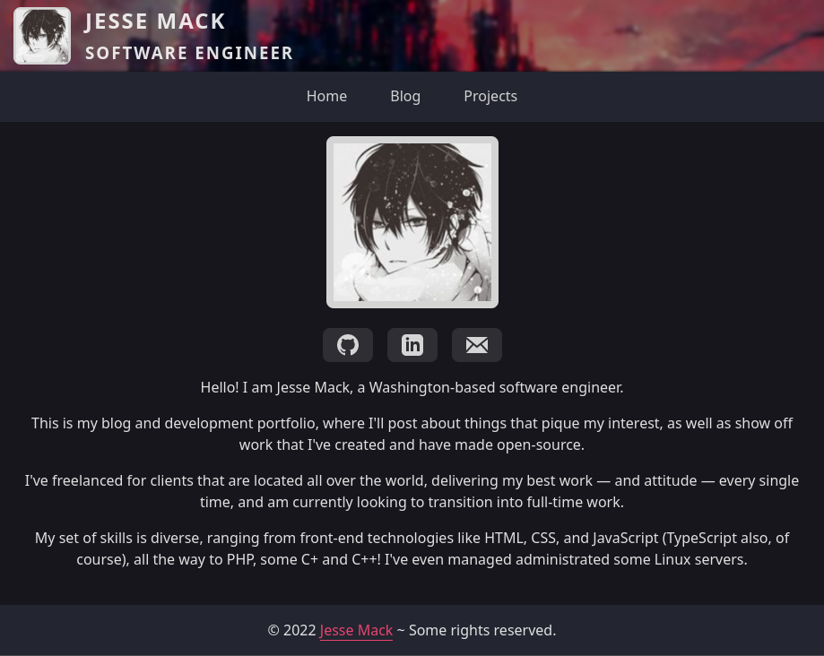

<div align="center">
  <h1 align="center">Toxocious' React (w/ Vite) Blogfolio</h1>

  I created this blog/portfolio repository in order to showcase my own projects, as well as my own thoughts on a variety of topics through a personalized blog.

  Other blog/portfolio templates didn't cut it for me, and I wanted to create something that was easy to use, add to, and painless to deploy to the web.

  If you're interested in using this repository as a template, please fork it and star it!

  
  
  
  
  <a href="https://hits.seeyoufarm.com">
    
  </a>
</div>


## Table of Contents
- [Table of Contents](#table-of-contents)
- [About The Project](#about-the-project)
  - [Screenshots](#screenshots)
  - [Tech Stack](#tech-stack)
  - [Features](#features)
- [Getting Started](#getting-started)
  - [Prequisites](#prequisites)
  - [Installation](#installation)
- [License](#license)


## About The Project
### Screenshots
<div align="center">
  
</div>

### Tech Stack
- Typescript
- React
  - Vite
- SASS

### Features
- Create and display blog `posts`
- Create and display `projects`


## Getting Started
### Prequisites
This project uses the **Yarn** package manager.

```sh
npm i -g yarn
```

### Installation
Clone the repository, install the necessary packages, and run the dev environment.

```sh
## Clone via HTTPS
# git clone https://github.com/Toxocious/FFXIV-Idle.git

## Clone via SSH
# git clone git@github.com:Toxocious/FFXIV-Idle.git

## CD into the repository directory
cd toxocious.github.io

## Install all needed modules.
yarn install

## Run Vite
yarn dev
```

### Building And Previewing
Build the project so that you can run it statically locally or remotely.

```sh
yarn build
```

Preview the build on a local network IP to preview the static generated site.

```sh
yarn preview
```

### Deploying To Github
The app can now be deployed to the provider of your choice, but we'll cover deployment to Github here.

Included with this repository is a ``./deploy.sh`` script, which will automatically push your code to the Github repository.

Be sure to set the correct repository URL inside of the ``./deploy.sh`` script before attempting to run it.

Once you've fixed the repository URL inside of the script, you can run the following command in your terminal to deploy.

**NOTE:: The script 

```sh
./deploy.sh
```

### Adding Blog Posts
Adding a blog post is as easy as adding a new Markdown file to the `./public/posts` directory.

The codebase requires posts to have three header fields, **title**, **description**, and **timestamp** in order to correctly parse the markdown file.

Posts are ordered from most to least recent.

**NOTE :: The `timestamp` field should be the current unix time * 1000**

Here's an example `post` file.
```markdown
---
title: Example Blog Post
timestamp: 1655667600000
description: Example Blog Post Description! I show up in the mini card when all posts are being rendered.
---

I'm the content of the markdown post that will be rendered on the full markdown post page when visited.
```

### Adding Project Posts
Adding a blog project is as easy as adding a new Markdown file to the `./public/projects` directory.

The codebase requires projects to have three header fields, **title**, **description**, and **timestamp**.

Optional header fields are:
- banner: pokemon-absolute
  - The image name for the banner.
  - The code base will look inside of `./public/projects_banners/` for a .png file with this name
- repo_path: git_username/repository_name
  - This will display a button linking to the repository's source code if filled out
- show_issues: true
  - If set to true, will display a badge of the repository's current issue count
- show_forks: true
  - If set to true, will display a badge of the repository's current fork count
- show_stars: true
  - If set to true, will display a badge of the repository's current star count
- show_license: true
  - If set to true, will display a badge of the repository's current license
- show_lines_of_code: true
  - If set to true, will display a badge of the repository's current lines of code count
- order: 1
  - The order to be placed when displaying a list of projects on the page

**NOTE :: The `timestamp` field should be the current unix time * 1000**

Here's an example `project` file.
```markdown
---
title: Awesome Example Project
tags: PHP, TypeScript, C++, Python, MySQL, Prisma, Rust
description: An awesome example project markdown file to show off an awesome project!
repo_path: example/project
show_issues: true
show_forks: true
show_stars: true
show_license: true
show_lines_of_code: false
order: 1
---

Information about some example project should go here! Show off and let us know what it's all about.
```


## License
Licensed under GNU GPL 3.

For more information, check out [LICENSE](LICENSE).
