

  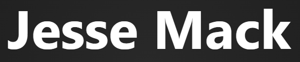
    

  <h1 align="center">My Portfolio</h1>

  I created this portfolio repository in order to showcase my own projects and to showcase freelance jobs that I've done.

  Other portfolio templates didn't cut it for me, and I wanted to create something that was easy to use, easy to add to, and painless to deploy to the web.

  If you're interested in using this repository as a template, please consider forking it and leaving a star.

  
  
  
  
  
    

  Check us out on Discord if you have any questions or immediate feedback!

  

 

# Table of Contents
- [Table of Contents](#table-of-contents)
- [Screenshots](#screenshots)
- [About The Project](#about-the-project)
  - [Tech Stack](#tech-stack)
  - [Features](#features)
- [License](#license)

# Screenshots

  

    
Desktop Previews

    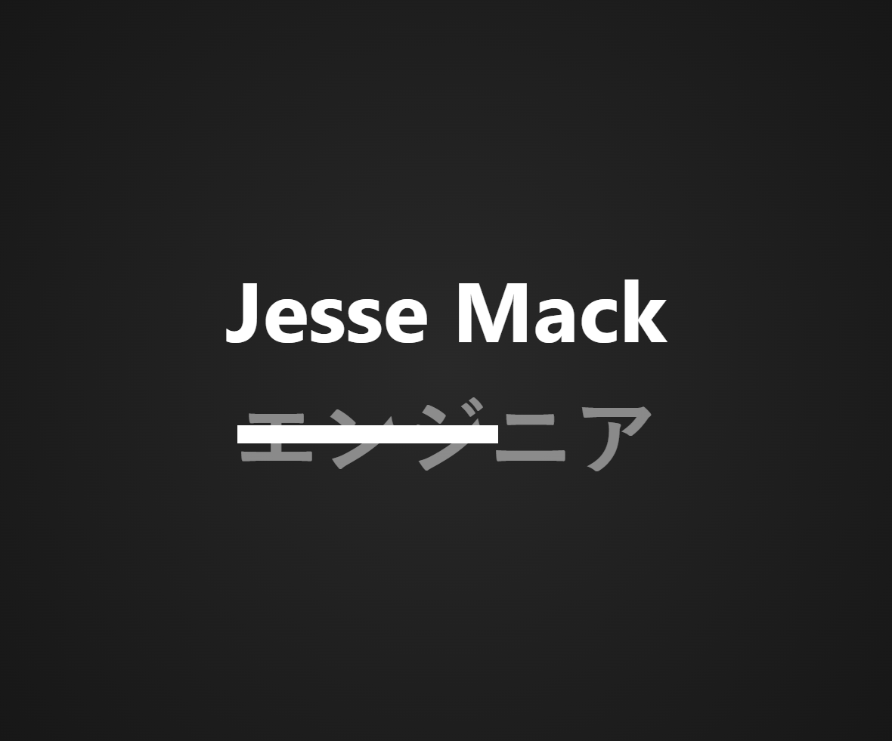
    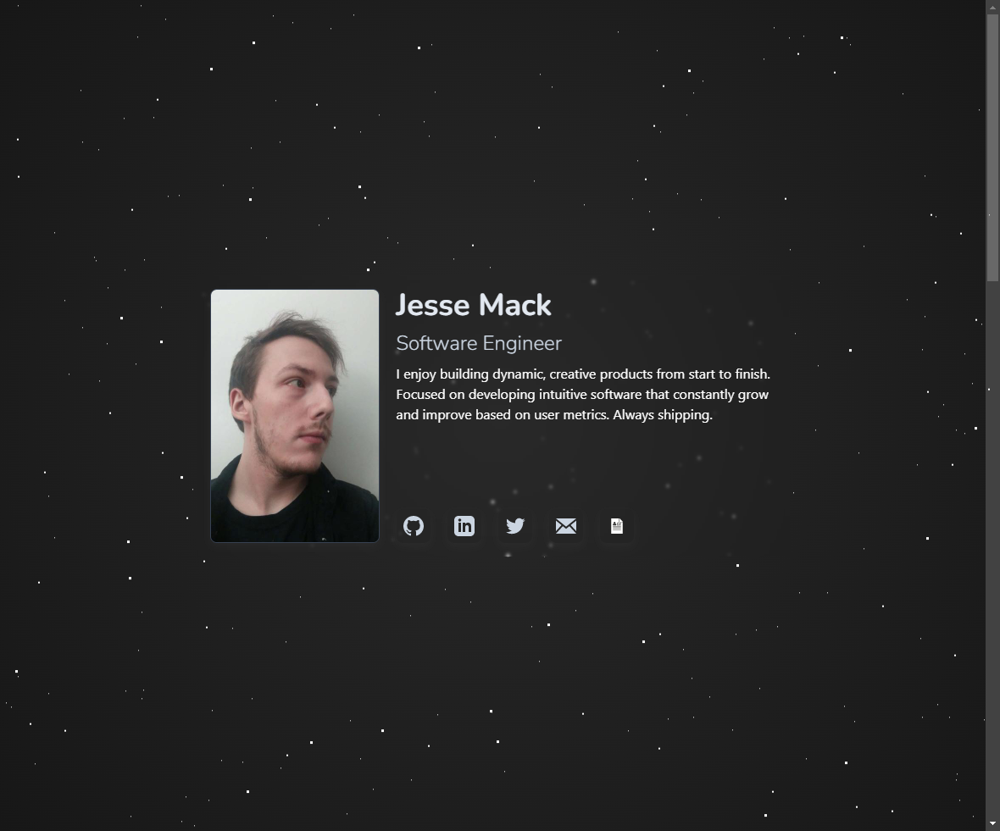
    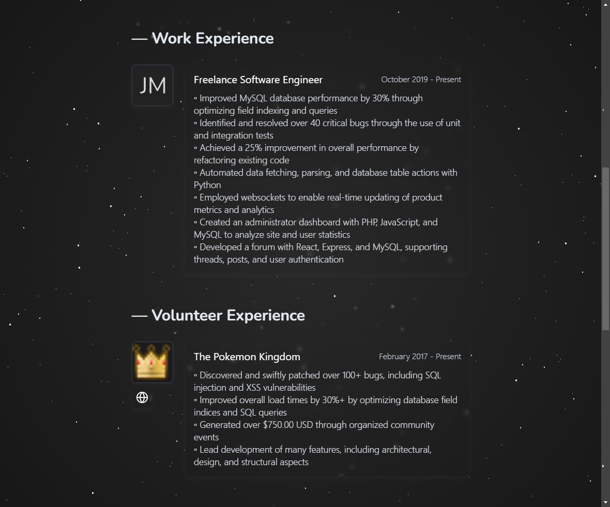
    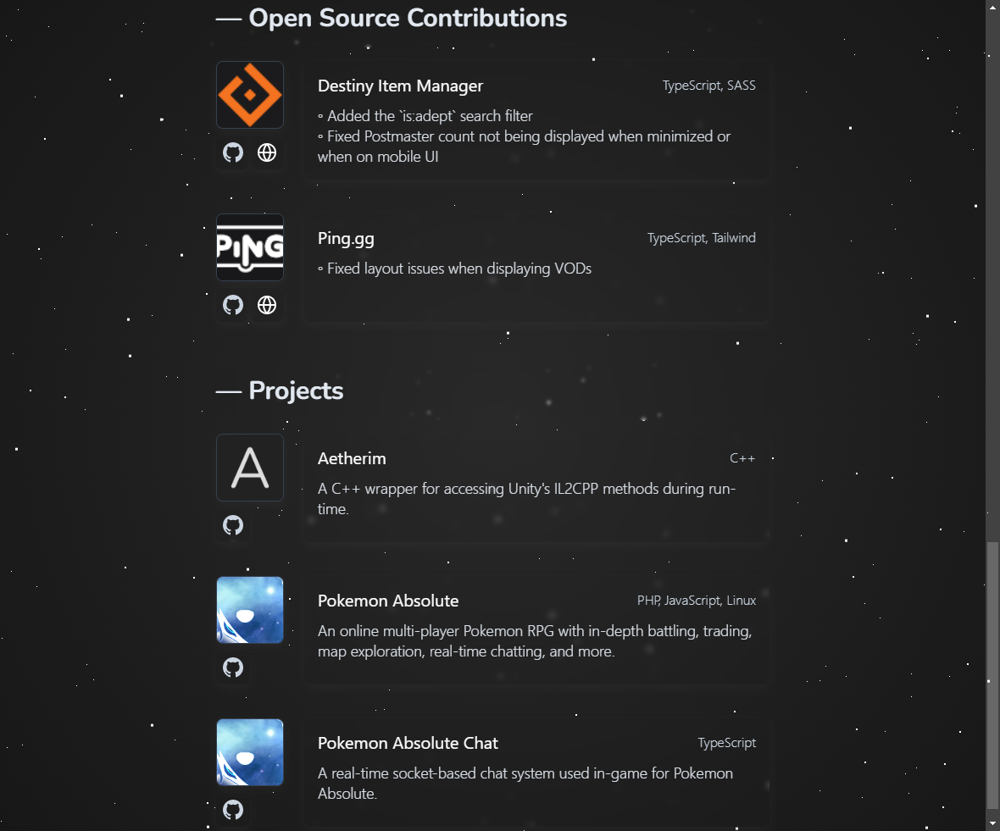
  

   

  

    
Mobile Previews

    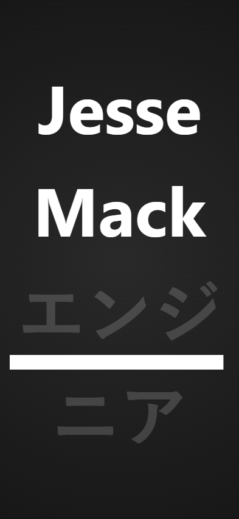
    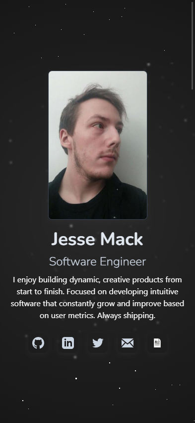
    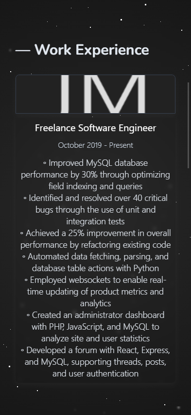
    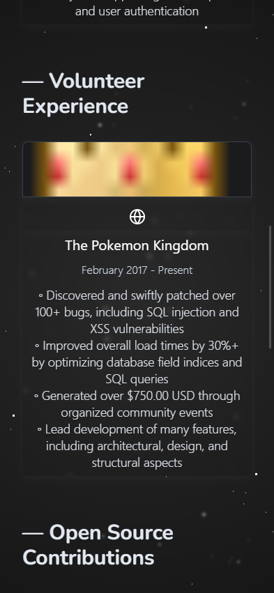
    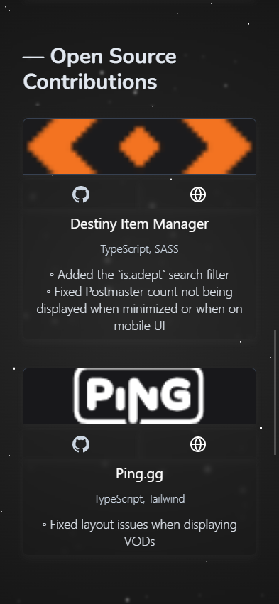
    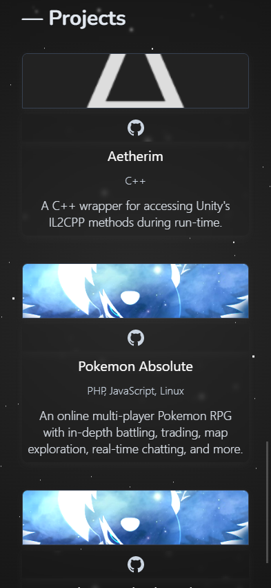
  

# About The Project
## Tech Stack
- TypeScript
- Astro
- Tailwind
- SASS

## Features
- Responsive layout and styling for mobile devices
- Create and display work history
- Create and display volunteer experience
- Create and display open-source contributions
- Create and display projects

# License
Licensed under GNU GPL 3.

For more information, check out [LICENSE](LICENSE).
