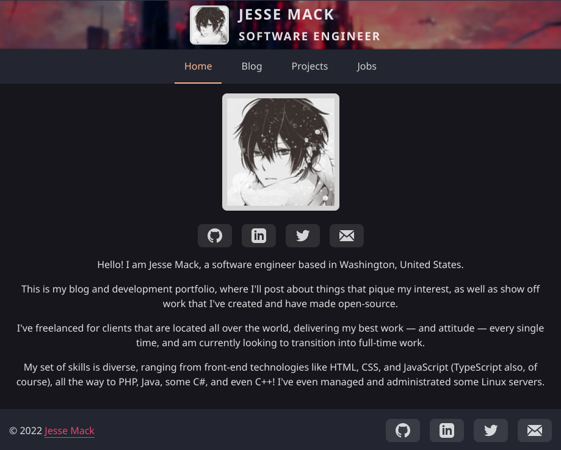

<div align="center">
  <h1 align="center">Toxocious' React (w/ Vite) Blogfolio</h1>

  I created this blog/portfolio repository in order to showcase my own projects, as well as my own thoughts on a variety of topics through a personalized blog.

  Other blog/portfolio templates didn't cut it for me, and I wanted to create something that was easy to use, add to, and painless to deploy to the web.

  If you're interested in using this repository as a template, please fork it and star it!

  
  
  
  
  <a href="https://visitorbadge.io/status?path=https%3A%2F%2Fgithub.com%2FToxocious%toxocious.github.io">
    
  </a>
</div>


# Table of Contents
- [Table of Contents](#table-of-contents)
- [About The Project](#about-the-project)
  - [Screenshots](#screenshots)
  - [Tech Stack](#tech-stack)
  - [Features](#features)
- [Getting Started](#getting-started)
  - [Prequisites](#prequisites)
  - [Installation](#installation)
  - [Building And Previewing](#building-and-previewing)
- [Deploying To Github](#deploying-to-github)
- [Updating Your Personal Information](#updating-your-personal-information)
- [Adding Blog Posts](#adding-blog-posts)
- [Adding Project Posts](#adding-project-posts)
- [Adding Work History Pages](#adding-work-history-pages)
- [License](#license)


# About The Project
## Screenshots
<div align="center">
  
</div>

## Tech Stack
- Typescript
- React
- Vite
- SASS

## Features
- Responsive layout and styling for mobile devices
- Create and display blog `posts`
- Create and display `projects`
- Create and display `work` history entries


# Getting Started
## Prequisites
This project uses the **Yarn** package manager.

```sh
npm i -g yarn
```

## Installation
Clone the repository, install the necessary packages, and run the dev environment.

```sh
## Clone via HTTPS
# git clone https://github.com/Toxocious/toxocious.github.io.git

## Clone via SSH
# git clone git@github.com:Toxocious/toxocious.github.io.git

## CD into the repository directory
cd toxocious.github.io

## Install all needed modules.
yarn install

## Run Vite
yarn dev
```

## Building And Previewing
Build the project so that you can run it statically locally or remotely.

```sh
yarn build
```

Preview the build on a local network IP to preview the static generated site.

```sh
yarn preview
```

# Deploying To Github
The app can now be deployed to the provider of your choice, but we'll cover deployment to Github here.

1. Navigate to the `Actions` tab of your repository
2. Find the `Node.js` action, and click `Configure`
3. In the editor, change line 19 from `node-version: [12.x, 14.x, 16.x]` to `node-version: [16.x]`
4. Add the `--force` flag to `npm ci` on line 29
  - Should look like this: `npm ci --force`
5. Commit the file
6. Navigate to the `Settings` tab of your repository
7. On the left-hand sidebar, click on the `Pages` link
8. Set the `Branch` to `gh-pages` and press `Save`

Once you've followed these steps and the deployment has completed, you can navigate to the URL associated with the Github Pages deployment in order to view your blog/portfolio.

# Updating Your Personal Information
For ease of use and to allow for quick updating of your personal information, a configuration file is included (`./src/config/config.ts`).

Various aspects of the site will grab your information from the values set in this file, such as your name, job title, and social links.

Currently, this file supports six key value pairs, which should be updated to use your specific information.

For any social links (git, linked_in, email, etc.), if you would like to omit the applicable buttons and links from your site, simply provide an empty string ('', quotes with nothing inside) and they will not be rendered to the page.

**Example Configuration**
```ts
export const CONFIGURATION = {
  name: 'FIRST LAST',
  occupation: 'JOB TITLE',
  location: 'SOMEWHERE, OVER HERE',

  git: 'https://github.com/USERNAME',
  linked_in: 'https://linkedin.com/in/USERNAME_OR_ID',
  email: 'example@example.com',
};
```

# Adding Blog Posts
Adding a blog post is as easy as adding a new Markdown file to the `./public/posts` directory.

File names must match the title listed in the Markdown file, but with spaces replaced to be hyphens.

**Example**
- Markdown Title: 'Example Blog Post'
- Markdown File Name: 'example-blog-post.md'

The codebase requires posts to have three header fields, **title**, **description**, and **timestamp** in order to correctly parse the markdown file.

Posts are ordered from most to least recent.

**NOTE :: The `timestamp` field should be the current unix time * 1000**

Here's an example `post` file.
```markdown
---
title: Example Blog Post
timestamp: 1655667600000
description: Example Blog Post Description! I show up in the mini card when all posts are being rendered.
---

I'm the content of the markdown post that will be rendered on the full markdown post page when visited.
```

# Adding Project Posts
Adding a blog project is as easy as adding a new Markdown file to the `./public/projects` directory.

File names must match the title listed in the Markdown file, but with spaces replaced to be hyphens.

**Example**
- Markdown Title: 'Example Project'
- Markdown File Name: 'example-project.md'

The codebase requires projects to have three header fields, **title**, **description**, and **timestamp**.

Optional header fields are:
- banner: pokemon-absolute
  - The image name for the banner.
  - The code base will look inside of `./public/projects_banners/` for a .png file with this name
- repo_path: git_username/repository_name
  - This will display a button linking to the repository's source code if filled out
- show_issues: true
  - If set to true, will display a badge of the repository's current issue count
- show_forks: true
  - If set to true, will display a badge of the repository's current fork count
- show_stars: true
  - If set to true, will display a badge of the repository's current star count
- show_license: true
  - If set to true, will display a badge of the repository's current license
- show_lines_of_code: true
  - If set to true, will display a badge of the repository's current lines of code count
- order: 1
  - The order to be placed when displaying a list of projects on the page

**NOTE :: The `timestamp` field should be the current unix time * 1000**

Here's an example `project` file.
```markdown
---
title: Awesome Example Project
tags: PHP, TypeScript, C++, Python, MySQL, Prisma, Rust
description: An awesome example project markdown file to show off an awesome project!
repo_path: example/project
show_issues: true
show_forks: true
show_stars: true
show_license: true
show_lines_of_code: false
order: 1
---

Information about some example project should go here! Show off and let us know what it's all about.
```

# Adding Work History Pages
Adding a blog post is as easy as adding a new Markdown file to the `./public/works` directory.

File names must match the title listed in the Markdown file, but with spaces replaced to be hyphens.

**Example**
- Markdown Title: 'Example Work Post'
- Markdown File Name: 'example-work-post.md'

The codebase requires work pages to have three header fields, **title**, **description**, and **timestamp** in order to correctly parse the markdown file.

Posts are ordered from most to least recent.

**NOTE :: Both the `timestamp` and `endTimestamp` field should be unix time * 1000**

Optional header fields are:
- banner: example-banner
  - The image name for the banner.
  - The code base will look inside of `./public/works_banners/` for a .png file with this name
- endTimestamp: A unix epoch timestamp of when you finished working there
  - If omitted, the work post will default to 'Present', implying that you still work there or on the application

Here's an example `works` file.
```markdown
---
title: Example Work Post
timestamp: 1655667600000
description: I was one of eight developers who worked to patch bug fixes, implement new features, enhance existing features, and handle dev ops.
---

I'm the content of the markdown work page that will be rendered on the full markdown work page when visited.
```


# License
Licensed under GNU GPL 3.

For more information, check out [LICENSE](LICENSE).
